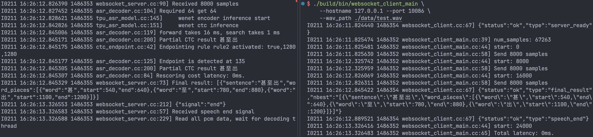
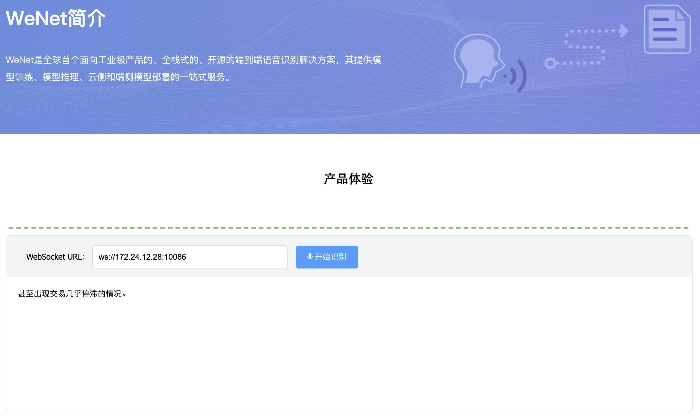

# WeNet & Sophgo TPU

### Setup
* Step 1. Setup environment. It depends on Sophgo driver.
```
# libsophon doc
https://doc.sophgo.com/sdk-docs/v23.09.01-lts/docs_latest_release/docs/libsophon/guide/html/1_install.html
```

* Step 2. Build decoder_main. It requires cmake 3.14 or above. (~3min)

``` sh
# Assume current dir is `Wenet-TPU`
# Local compole, for PCIE mode
cmake -B build -DTPU=ON -DONNX=OFF -DTORCH=OFF -DWEBSOCKET=OFF -DGRPC=OFF
cmake --build build -j$(nproc)

# Cross compile, for SOC mode
# install if need
sudo apt-get install gcc-aarch64-linux-gnu g++-aarch64-linux-gnu
# set SDK path
cmake -B build -DTPU=ON -DONNX=OFF -DTORCH=OFF -DWEBSOCKET=OFF -DGRPC=OFF -DSDK=/path/to/soc-sdk -DCMAKE_TOOLCHAIN_FILE=toolchains/aarch64-linux-gnu.toolchain.cmake
cmake --build build -j$(nproc)
# copy build/bin/decoder_main to device
```

* Step 3. Download the model and place it in the `bmodel` folder.

``` sh
# Download bmodel
https://drive.google.com/drive/folders/1QCynsCRFdyS6TgM3yLNjNHLvKfojN5Y5?usp=sharing

./bmodel
├── ctc.bmodel
├── encoder.bmodel
└── units.txt
```

* Step 4. Testing on Sophgo BM1684X(PCIE/SOC), the RTF(real time factor) is shown in console.

``` sh
export LD_LIBRARY_PATH=.:$LD_LIBRARY_PATH
export GLOG_logtostderr=1
export GLOG_v=3
./build/bin/decoder_main \
    --chunk_size 8 \
    --num_left_chunks 16 \
    --rescoring_weight 0.0 \
    --wav_path ./data/test.wav \
    --tpu_model_dir ./bmodel \
    --unit_path ./bmodel/units.txt 2>&1 | tee log.txt

I0218 20:02:57.592820 2349253 params.h:224] Reading SOPHGO TPU model from ./bmodel
I0218 20:02:58.228825 2349253 tpu_asr_model.cc:60] TPU Encoder:
I0218 20:02:58.228866 2349253 tpu_asr_model.cc:15]      Input-0: Shape [1,1,71,80]
I0218 20:02:58.228873 2349253 tpu_asr_model.cc:15]      Input-1: Shape [1,96,128,128]
I0218 20:02:58.228878 2349253 tpu_asr_model.cc:15]      Input-2: Shape [1,512,12,6]
I0218 20:02:58.228883 2349253 tpu_asr_model.cc:15]      Input-3: Shape [1,8,8,136]
I0218 20:02:58.228888 2349253 tpu_asr_model.cc:22]      Output-0: Shape [1,512,1,8]
I0218 20:02:58.228893 2349253 tpu_asr_model.cc:22]      Output-1: Shape [1,96,128,128]
I0218 20:02:58.228896 2349253 tpu_asr_model.cc:22]      Output-2: Shape [1,512,12,6]
I0218 20:02:58.228901 2349253 tpu_asr_model.cc:62] TPU CTC:
I0218 20:02:58.228906 2349253 tpu_asr_model.cc:15]      Input-0: Shape [1,512,1,8]
I0218 20:02:58.228910 2349253 tpu_asr_model.cc:22]      Output-0: Shape [1,5538,1,8]
I0218 20:02:58.228915 2349253 tpu_asr_model.cc:79] TPU Model Info:
I0218 20:02:58.228919 2349253 tpu_asr_model.cc:80]      chunk_size 8
I0218 20:02:58.228924 2349253 tpu_asr_model.cc:81]      num_left_chunks 16
I0218 20:02:58.228929 2349253 tpu_asr_model.cc:82]      subsampling_rate 8
I0218 20:02:58.228933 2349253 tpu_asr_model.cc:83]      right context 14
I0218 20:02:58.228937 2349253 tpu_asr_model.cc:84]      sos 5537
I0218 20:02:58.228941 2349253 tpu_asr_model.cc:85]      eos 5537
I0218 20:02:58.228945 2349253 tpu_asr_model.cc:86]      is bidirectional decoder 0
I0218 20:02:58.228950 2349253 tpu_asr_model.cc:87]      hidden_dim 512
I0218 20:02:58.228955 2349253 params.h:236] Reading unit table ./bmodel/units.txt
I0218 20:02:58.254217 2349258 decoder_main.cc:54] num frames 418
I0218 20:02:58.275568 2349258 asr_decoder.cc:104] Required 71 get 71
I0218 20:02:58.276309 2349258 tpu_asr_model.cc:145]     wenet encoder inference start
I0218 20:02:58.290501 2349258 tpu_asr_model.cc:151]     wenet ctc inference
I0218 20:02:58.297973 2349258 asr_decoder.cc:119] forward takes 16 ms, search takes 6 ms
I0218 20:02:58.298957 2349258 asr_decoder.cc:104] Required 64 get 64
I0218 20:02:58.300158 2349258 tpu_asr_model.cc:145]     wenet encoder inference start
I0218 20:02:58.314263 2349258 tpu_asr_model.cc:151]     wenet ctc inference
I0218 20:02:58.321837 2349258 asr_decoder.cc:119] forward takes 16 ms, search takes 6 ms
I0218 20:02:58.322494 2349258 asr_decoder.cc:200] Partial CTC result 甚至出
I0218 20:02:58.322521 2349258 decoder_main.cc:72] Partial result: 甚至出
I0218 20:02:58.322566 2349258 asr_decoder.cc:104] Required 64 get 64
I0218 20:02:58.323271 2349258 tpu_asr_model.cc:145]     wenet encoder inference start
I0218 20:02:58.337425 2349258 tpu_asr_model.cc:151]     wenet ctc inference
I0218 20:02:58.345198 2349258 asr_decoder.cc:119] forward takes 15 ms, search takes 6 ms
I0218 20:02:58.345960 2349258 asr_decoder.cc:200] Partial CTC result 甚至出现交
I0218 20:02:58.345988 2349258 decoder_main.cc:72] Partial result: 甚至出现交
I0218 20:02:58.346033 2349258 asr_decoder.cc:104] Required 64 get 64
I0218 20:02:58.346920 2349258 tpu_asr_model.cc:145]     wenet encoder inference start
I0218 20:02:58.361013 2349258 tpu_asr_model.cc:151]     wenet ctc inference
I0218 20:02:58.368747 2349258 asr_decoder.cc:119] forward takes 15 ms, search takes 6 ms
I0218 20:02:58.369547 2349258 asr_decoder.cc:200] Partial CTC result 甚至出现交易几乎
I0218 20:02:58.369575 2349258 decoder_main.cc:72] Partial result: 甚至出现交易几乎
I0218 20:02:58.369627 2349258 asr_decoder.cc:104] Required 64 get 64
I0218 20:02:58.370513 2349258 tpu_asr_model.cc:145]     wenet encoder inference start
I0218 20:02:58.384685 2349258 tpu_asr_model.cc:151]     wenet ctc inference
I0218 20:02:58.392577 2349258 asr_decoder.cc:119] forward takes 15 ms, search takes 6 ms
I0218 20:02:58.393424 2349258 asr_decoder.cc:200] Partial CTC result 甚至出现交易几乎停滞的
I0218 20:02:58.393453 2349258 decoder_main.cc:72] Partial result: 甚至出现交易几乎停滞的
I0218 20:02:58.393502 2349258 asr_decoder.cc:104] Required 64 get 64
I0218 20:02:58.394282 2349258 tpu_asr_model.cc:145]     wenet encoder inference start
I0218 20:02:58.408318 2349258 tpu_asr_model.cc:151]     wenet ctc inference
I0218 20:02:58.416445 2349258 asr_decoder.cc:119] forward takes 15 ms, search takes 7 ms
I0218 20:02:58.417212 2349258 asr_decoder.cc:200] Partial CTC result 甚至出现交易几乎停滞的情况
I0218 20:02:58.417238 2349258 decoder_main.cc:72] Partial result: 甚至出现交易几乎停滞的情况
I0218 20:02:58.417268 2349258 asr_decoder.cc:104] Required 64 get 27
I0218 20:02:58.418009 2349258 tpu_asr_model.cc:145]     wenet encoder inference start
I0218 20:02:58.432065 2349258 tpu_asr_model.cc:151]     wenet ctc inference
I0218 20:02:58.439682 2349258 asr_decoder.cc:119] forward takes 15 ms, search takes 6 ms
I0218 20:02:58.440428 2349258 asr_decoder.cc:200] Partial CTC result 甚至出现交易几乎停滞的情况
I0218 20:02:58.441246 2349258 asr_decoder.cc:200] Partial CTC result 甚至出现交易几乎停滞的情况
I0218 20:02:58.441252 2349258 asr_decoder.cc:84] Rescoring cost latency: 0ms.
I0218 20:02:58.441257 2349258 decoder_main.cc:72] Partial result: 甚至出现交易几乎停滞的情况
I0218 20:02:58.441262 2349258 decoder_main.cc:104] test Final result: 甚至出现交易几乎停滞的情况
I0218 20:02:58.441270 2349258 decoder_main.cc:105] Decoded 4203ms audio taken 162ms.
[BMRT][bmcpu_setup:435] INFO:cpu_lib 'libcpuop.so' is loaded.
bmcpu init: skip cpu_user_defined
open usercpu.so, init user_cpu_init
[BMRT][BMProfile:59] INFO:Profile For arch=3
[BMRT][BMProfileDeviceBase:190] INFO:gdma=0, tiu=0, mcu=0
[BMRT][load_bmodel:1594] INFO:Loading bmodel from [./bmodel/encoder.bmodel]. Thanks for your patience...
[BMRT][load_bmodel:1503] INFO:pre net num: 0, load net num: 1
[BMRT][load_tpu_module:1575] INFO:loading firmare in bmodel
[BMRT][bmcpu_setup:435] INFO:cpu_lib 'libcpuop.so' is loaded.
bmcpu init: skip cpu_user_defined
open usercpu.so, init user_cpu_init
[BMRT][BMProfile:59] INFO:Profile For arch=3
[BMRT][BMProfileDeviceBase:190] INFO:gdma=0, tiu=0, mcu=0
[BMRT][load_bmodel:1594] INFO:Loading bmodel from [./bmodel/ctc.bmodel]. Thanks for your patience...
[BMRT][load_bmodel:1503] INFO:pre net num: 0, load net num: 1
[BMRT][load_tpu_module:1575] INFO:loading firmare in bmodel
test 甚至出现交易几乎停滞的情况
I0218 20:02:58.467502 2349253 decoder_main.cc:180] Total: decoded 4203ms audio taken 162ms.
I0218 20:02:58.467532 2349253 decoder_main.cc:182] RTF: 0.03854
```

### Server and client
start websocket server
```sh
# set -DWEBSOCKET=ON
cmake -B build -DTPU=ON -DONNX=OFF -DTORCH=OFF -DWEBSOCKET=ON -DGRPC=OFF
cmake --build build -j$(nproc)
export GLOG_logtostderr=1
export GLOG_v=3
./build/bin/websocket_server_main \
    --chunk_size 8 \
    --num_left_chunks 16 \
    --rescoring_weight 0.0 \
    --tpu_model_dir ./bmodel \
    --unit_path ./bmodel/units.txt
I0218 14:05:29.312755 2256320 params.h:224] Reading SOPHGO TPU model from ./bmodel
[BMRT][bmcpu_setup:435] INFO:cpu_lib 'libcpuop.so' is loaded.
bmcpu init: skip cpu_user_defined
open usercpu.so, init user_cpu_init
[BMRT][BMProfile:59] INFO:Profile For arch=3
[BMRT][BMProfileDeviceBase:190] INFO:gdma=0, tiu=0, mcu=0
[BMRT][load_bmodel:1594] INFO:Loading bmodel from [./bmodel/encoder.bmodel]. Thanks for your patience...
[BMRT][load_bmodel:1503] INFO:pre net num: 0, load net num: 1
[BMRT][load_tpu_module:1575] INFO:loading firmare in bmodel
[BMRT][bmcpu_setup:435] INFO:cpu_lib 'libcpuop.so' is loaded.
bmcpu init: skip cpu_user_defined
open usercpu.so, init user_cpu_init
[BMRT][BMProfile:59] INFO:Profile For arch=3
[BMRT][BMProfileDeviceBase:190] INFO:gdma=0, tiu=0, mcu=0
[BMRT][load_bmodel:1594] INFO:Loading bmodel from [./bmodel/ctc.bmodel]. Thanks for your patience...
[BMRT][load_bmodel:1503] INFO:pre net num: 0, load net num: 1
[BMRT][load_tpu_module:1575] INFO:loading firmare in bmodel
I0218 14:05:29.980463 2256320 tpu_asr_model.cc:60] TPU Encoder:
I0218 14:05:29.980515 2256320 tpu_asr_model.cc:15]      Input-0: Shape [1,1,71,80]
I0218 14:05:29.980526 2256320 tpu_asr_model.cc:15]      Input-1: Shape [1,96,128,128]
I0218 14:05:29.980535 2256320 tpu_asr_model.cc:15]      Input-2: Shape [1,512,12,6]
I0218 14:05:29.980542 2256320 tpu_asr_model.cc:15]      Input-3: Shape [1,8,8,136]
I0218 14:05:29.980551 2256320 tpu_asr_model.cc:22]      Output-0: Shape [1,512,1,8]
I0218 14:05:29.980558 2256320 tpu_asr_model.cc:22]      Output-1: Shape [1,96,128,128]
I0218 14:05:29.980566 2256320 tpu_asr_model.cc:22]      Output-2: Shape [1,512,12,6]
I0218 14:05:29.980574 2256320 tpu_asr_model.cc:62] TPU CTC:
I0218 14:05:29.980584 2256320 tpu_asr_model.cc:15]      Input-0: Shape [1,512,1,8]
I0218 14:05:29.980594 2256320 tpu_asr_model.cc:22]      Output-0: Shape [1,5538,1,8]
I0218 14:05:29.980607 2256320 tpu_asr_model.cc:79] TPU Model Info:
I0218 14:05:29.980615 2256320 tpu_asr_model.cc:80]      chunk_size 8
I0218 14:05:29.980626 2256320 tpu_asr_model.cc:81]      num_left_chunks 16
I0218 14:05:29.980634 2256320 tpu_asr_model.cc:82]      subsampling_rate 8
I0218 14:05:29.980643 2256320 tpu_asr_model.cc:83]      right context 14
I0218 14:05:29.980648 2256320 tpu_asr_model.cc:84]      sos 5537
I0218 14:05:29.980655 2256320 tpu_asr_model.cc:85]      eos 5537
I0218 14:05:29.980662 2256320 tpu_asr_model.cc:86]      is bidirectional decoder 0
I0218 14:05:29.980669 2256320 tpu_asr_model.cc:87]      hidden_dim 512
I0218 14:05:29.980677 2256320 params.h:236] Reading unit table ./bmodel/units.txt
I0218 14:05:29.989405 2256320 websocket_server_main.cc:31] Listening at port 10086
I0218 14:05:32.534153 2256347 websocket_server.cc:212] {"signal":"start","nbest":1,"continuous_decoding":true}
I0218 14:05:32.534245 2256347 websocket_server.cc:43] Received speech start signal, start reading speech
I0218 14:05:32.577821 2256347 websocket_server.cc:90] Received 8000 samples
I0218 14:05:33.037973 2256347 websocket_server.cc:90] Received 8000 samples
I0218 14:05:33.043511 2256349 asr_decoder.cc:104] Required 71 get 71
I0218 14:05:33.045230 2256349 tpu_asr_model.cc:145]     wenet encoder inference start
I0218 14:05:33.059576 2256349 tpu_asr_model.cc:151]     wenet ctc inference
I0218 14:05:33.066959 2256349 asr_decoder.cc:119] forward takes 17 ms, search takes 5 ms
I0218 14:05:33.539042 2256347 websocket_server.cc:90] Received 8000 samples
I0218 14:05:33.544203 2256349 asr_decoder.cc:104] Required 64 get 64
I0218 14:05:33.545972 2256349 tpu_asr_model.cc:145]     wenet encoder inference start
I0218 14:05:33.560317 2256349 tpu_asr_model.cc:151]     wenet ctc inference
I0218 14:05:33.565702 2256349 asr_decoder.cc:119] forward takes 17 ms, search takes 4 ms
I0218 14:05:33.566334 2256349 asr_decoder.cc:200] Partial CTC result 甚至出
I0218 14:05:33.566395 2256349 websocket_server.cc:65] Partial result: [{"sentence":"甚至出"}]
I0218 14:05:34.081866 2256347 websocket_server.cc:90] Received 8000 samples
I0218 14:05:34.541147 2256347 websocket_server.cc:90] Received 8000 samples
I0218 14:05:34.546483 2256349 asr_decoder.cc:104] Required 64 get 64
I0218 14:05:34.548431 2256349 tpu_asr_model.cc:145]     wenet encoder inference start
I0218 14:05:34.562978 2256349 tpu_asr_model.cc:151]     wenet ctc inference
I0218 14:05:34.571406 2256349 asr_decoder.cc:119] forward takes 17 ms, search takes 7 ms
I0218 14:05:34.572223 2256349 asr_decoder.cc:200] Partial CTC result 甚至出现交
I0218 14:05:34.572293 2256349 websocket_server.cc:65] Partial result: [{"sentence":"甚至出现交"}]
I0218 14:05:35.085868 2256347 websocket_server.cc:90] Received 8000 samples
I0218 14:05:35.091156 2256349 asr_decoder.cc:104] Required 64 get 64
I0218 14:05:35.092988 2256349 tpu_asr_model.cc:145]     wenet encoder inference start
I0218 14:05:35.107556 2256349 tpu_asr_model.cc:151]     wenet ctc inference
I0218 14:05:35.116329 2256349 asr_decoder.cc:119] forward takes 17 ms, search takes 7 ms
I0218 14:05:35.117182 2256349 asr_decoder.cc:200] Partial CTC result 甚至出现交易几乎
I0218 14:05:35.117251 2256349 websocket_server.cc:65] Partial result: [{"sentence":"甚至出现交易几乎"}]
I0218 14:05:35.585850 2256347 websocket_server.cc:90] Received 8000 samples
I0218 14:05:35.591066 2256349 asr_decoder.cc:104] Required 64 get 64
I0218 14:05:35.592864 2256349 tpu_asr_model.cc:145]     wenet encoder inference start
I0218 14:05:35.607343 2256349 tpu_asr_model.cc:151]     wenet ctc inference
I0218 14:05:35.614553 2256349 asr_decoder.cc:119] forward takes 17 ms, search takes 5 ms
I0218 14:05:35.614774 2256349 asr_decoder.cc:200] Partial CTC result 甚至出现交易几乎停滞的
I0218 14:05:35.614790 2256349 websocket_server.cc:65] Partial result: [{"sentence":"甚至出现交易几乎停滞的"}]
I0218 14:05:36.085853 2256347 websocket_server.cc:90] Received 8000 samples
I0218 14:05:36.091145 2256349 asr_decoder.cc:104] Required 64 get 64
I0218 14:05:36.093070 2256349 tpu_asr_model.cc:145]     wenet encoder inference start
I0218 14:05:36.107636 2256349 tpu_asr_model.cc:151]     wenet ctc inference
I0218 14:05:36.116271 2256349 asr_decoder.cc:119] forward takes 17 ms, search takes 7 ms
I0218 14:05:36.117182 2256349 asr_decoder.cc:200] Partial CTC result 甚至出现交易几乎停滞的情况
I0218 14:05:36.117251 2256349 websocket_server.cc:65] Partial result: [{"sentence":"甚至出现交易几乎停滞的情况"}]
I0218 14:05:36.585665 2256347 websocket_server.cc:90] Received 3263 samples
I0218 14:05:37.044373 2256347 websocket_server.cc:212] {"signal":"end"}
I0218 14:05:37.044456 2256347 websocket_server.cc:57] Received speech end signal
I0218 14:05:37.044474 2256347 websocket_server.cc:229] Read all pcm data, wait for decoding thread
I0218 14:05:37.044581 2256349 asr_decoder.cc:104] Required 64 get 27
I0218 14:05:37.046546 2256349 tpu_asr_model.cc:145]     wenet encoder inference start
I0218 14:05:37.061100 2256349 tpu_asr_model.cc:151]     wenet ctc inference
I0218 14:05:37.068156 2256349 asr_decoder.cc:119] forward takes 17 ms, search takes 5 ms
I0218 14:05:37.068360 2256349 asr_decoder.cc:200] Partial CTC result 甚至出现交易几乎停滞的情况
I0218 14:05:37.068529 2256349 asr_decoder.cc:200] Partial CTC result 甚至出现交易几乎停滞的情况
I0218 14:05:37.068531 2256349 asr_decoder.cc:84] Rescoring cost latency: 0ms.
I0218 14:05:37.068584 2256349 websocket_server.cc:73] Final result: [{"sentence":"甚至出现交易几乎停滞的情况","word_pieces":[{"word":"甚","start":540,"end":640},{"word":"至","start":780,"end":880},{"word":"出","start":1100,"end":1200},{"word":"现","start":1340,"end":1440},{"word":"交","start":1580,"end":1680},{"word":"易","start":1820,"end":1920},{"word":"几","start":2140,"end":2240},{"word":"乎","start":2300,"end":2400},{"word":"停","start":2540,"end":2640},{"word":"滞","start":2780,"end":2880},{"word":"的","start":2940,"end":3040},{"word":"情","start":3180,"end":3280},{"word":"况","start":3420,"end":3520}]}]
```
start client in another terminal
```sh
export GLOG_logtostderr=1
export GLOG_v=3
./build/bin/websocket_client_main \
    --hostname 127.0.0.1 --port 10086 \
    --wav_path ./data/test.wav

I0218 14:05:32.534451 2256348 websocket_client.cc:67] {"status":"ok","type":"server_ready"}
I0218 14:05:32.536726 2256346 websocket_client_main.cc:56] Send 8000 samples
I0218 14:05:33.037812 2256346 websocket_client_main.cc:56] Send 8000 samples
I0218 14:05:33.538902 2256346 websocket_client_main.cc:56] Send 8000 samples
I0218 14:05:33.566591 2256348 websocket_client.cc:67] {"status":"ok","type":"partial_result","nbest":"[{\"sentence\":\"甚至出\"}]"}
I0218 14:05:34.039932 2256346 websocket_client_main.cc:56] Send 8000 samples
I0218 14:05:34.541009 2256346 websocket_client_main.cc:56] Send 8000 samples
I0218 14:05:34.572508 2256348 websocket_client.cc:67] {"status":"ok","type":"partial_result","nbest":"[{\"sentence\":\"甚至出现交\"}]"}
I0218 14:05:35.041317 2256346 websocket_client_main.cc:56] Send 8000 samples
I0218 14:05:35.117462 2256348 websocket_client.cc:67] {"status":"ok","type":"partial_result","nbest":"[{\"sentence\":\"甚至出现交易几乎\"}]"}
I0218 14:05:35.542326 2256346 websocket_client_main.cc:56] Send 8000 samples
I0218 14:05:35.614902 2256348 websocket_client.cc:67] {"status":"ok","type":"partial_result","nbest":"[{\"sentence\":\"甚至出现交易几乎停滞的\"}]"}
I0218 14:05:36.043318 2256346 websocket_client_main.cc:56] Send 8000 samples
I0218 14:05:36.117471 2256348 websocket_client.cc:67] {"status":"ok","type":"partial_result","nbest":"[{\"sentence\":\"甚至出现交易几乎停滞的情况\"}]"}
I0218 14:05:36.543923 2256346 websocket_client_main.cc:56] Send 3263 samples
I0218 14:05:37.068686 2256348 websocket_client.cc:67] {"status":"ok","type":"final_result","nbest":"[{\"sentence\":\"甚至出现交易几乎停滞的情况\",\"word_pieces\":[{\"word\":\"甚\",\"start\":540,\"end\":640},{\"word\":\"至\",\"start\":780,\"end\":880},{\"word\":\"出\",\"start\":1100,\"end\":1200},{\"word\":\"现\",\"start\":1340,\"end\":1440},{\"word\":\"交\",\"start\":1580,\"end\":1680},{\"word\":\"易\",\"start\":1820,\"end\":1920},{\"word\":\"几\",\"start\":2140,\"end\":2240},{\"word\":\"乎\",\"start\":2300,\"end\":2400},{\"word\":\"停\",\"start\":2540,\"end\":2640},{\"word\":\"滞\",\"start\":2780,\"end\":2880},{\"word\":\"的\",\"start\":2940,\"end\":3040},{\"word\":\"情\",\"start\":3180,\"end\":3280},{\"word\":\"况\",\"start\":3420,\"end\":3520}]}]"}
I0218 14:05:37.068723 2256348 websocket_client.cc:67] {"status":"ok","type":"speech_end"}
I0218 14:05:37.068796 2256346 websocket_client_main.cc:63] Total latency: 24ms.
```


### Server and web
```sh
# 1. trun on the websocket first
# 2. copy web file to local, and turn on the templates/index.html by browser
# 3. if you start server in the edge, bind ip and trun on browser in local pc
ssh -L {local-port}:127.0.0.1:{host-port} {user}@{host-ip}
```


### Hotword boosting
In Automatic Speech Recognition (ASR) systems, hotword boosting, also known as biasing or hotword replacement, is a technique that allows developers and users to specify a set of words or phrases that should be given higher priority during the speech recognition process. This technique is particularly useful for dealing with proper nouns, brand names, technical terms, or words that may not be commonly present in the standard vocabulary of the recognizer.

The purpose of hotword boosting is to increase the recognition accuracy of these specified terms, even in challenging listening conditions such as high background noise or unclear pronunciation. This is critical in many applications, such as in the medical, legal, or specialized industry sectors, where the accurate recognition of jargon is necessary.

```sh
# --context_path context.txt --context_score 10
./build/bin/decoder_main \
    --chunk_size 8 \
    --num_left_chunks 16 \
    --rescoring_weight 0.0 \
    --wav_path ./data/test.wav \
    --tpu_model_dir ./bmodel \
    --unit_path ./bmodel/units.txt \
    --context_path context.txt \
    --context_score 10 2>&1 | tee log.txt

# result "停滞"  -> "停止"
test 甚至出现交易几乎停止的情况
```